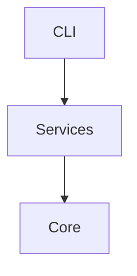
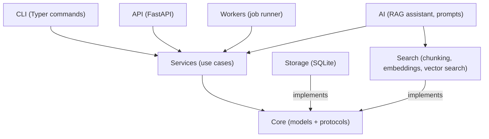
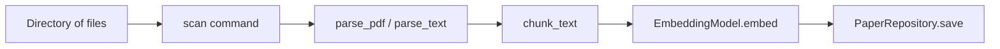
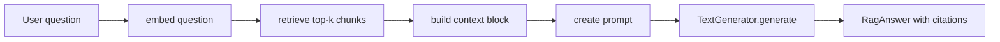

<!-- NAV_START -->
---
[🏠 Home](../../../README.md) · [🗺 Roadmap](../../../ROADMAP.md) · [📋 Syllabus](../../../SYLLABUS.md) · [🗂 Curriculum Map](../../NAVIGATION.md) · [📅 Month 5: Production and Portfolio](../README.md)

**Week 19 — Documentation and Portfolio Polish:** [README](README.md) · **Notes** · [Exercises](exercises.md) · [Break It](break_it.md) · [Validation](validation.md) · [Reflection](reflection.md)

⬅️ [← README](README.md) · ➡️ [Exercises →](exercises.md)

---
<!-- NAV_END -->

# Week 19 Notes: Documentation and Portfolio Polish

## Chapter overview

This chapter teaches you to turn a working codebase into a legible, presentable, employer-ready project. You will learn:

- Why documentation is engineering work, not decoration.
- How to write docstrings that follow real conventions (PEP 257 and the Google style), and how Python's own tooling reads them.
- How to structure a multi-page documentation site the way tools such as MkDocs and Sphinx expect, even before you adopt either tool.
- How to express architecture as **diagrams-as-code** with Mermaid, so your diagrams live in version control next to the code they describe.
- How to write a README that works for four different readers at once.
- How to write a demo script that cannot fail in front of an interviewer.
- How to write limitations, tradeoffs, and a portfolio narrative that demonstrate engineering judgment.

By the end of this week, the ResearchOps repository should be something you can hand to a stranger — a recruiter, an engineer, a professor — and they can understand it, run it, and respect it without you in the room.

There is no new runtime behaviour this week. Every deliverable is text: docstrings, Markdown, and diagrams. That makes this week feel "easy", which is exactly why most learners skip it and end up with a portfolio of repositories nobody can evaluate. Do not skip it.

---

## What you already know from previous weeks

You arrive at Week 19 with a complete, working system. Everything below already exists in your repository, and this week's job is to *explain* it:

- **Weeks 1–4 (Month 1)**: you built the core domain models (`Paper`, `PaperStatus`), custom exceptions, logging, the Typer CLI, and packaging with `pyproject.toml` entry points. The README's Quick Start section documents exactly the `pip install -e ".[all]"` flow you set up in Week 4.
- **Weeks 5–8 (Month 2)**: you added SQLite storage, the PDF parsing pipeline, keyword search, and multiprocessing ingestion. The ingestion pipeline diagram you draw this week traces the code path you wrote in Weeks 6 and 8.
- **Weeks 9–10 (Month 3)**: you refactored to `typing.Protocol` interfaces in `core/interfaces.py` and built the test pyramid with fakes in `tests/fakes/`. The architecture document you finish this week explains *why* you did that.
- **Weeks 11–12**: classical ML topic classification and experiment tracking. Your limitations section must be honest about how far that model generalizes.
- **Weeks 13–16 (Month 4)**: embeddings, semantic search, the FastAPI layer, async I/O, and the worker job system. The API section of your demo script exercises the endpoints you built in Week 14.
- **Weeks 17–18 (Month 5)**: the RAG assistant and Docker packaging. The RAG pipeline diagram you draw this week is the seven-step pipeline from Week 17's notes, drawn instead of prosed.

You have also been writing Markdown all along: every `reflection.md` you completed was practice for this week. The difference now is audience. Reflections were written for you. This week's documents are written for strangers.

---

## What problem this week solves

Here is the uncomfortable truth: **an undocumented project does not exist for anyone but its author, and only for a few months.**

Concretely, three problems appear the moment another human (including future you) touches the repository:

1. **The evaluation problem.** When you apply for engineering roles, the reviewer reads the README before any code. They spend 30–90 seconds deciding whether to look further. If the README is missing, vague, or broken, the 19 weeks of engineering behind it are invisible. The README *is* the interface to your portfolio.

2. **The re-entry problem.** Six months from now you will not remember why `services/` depends on protocols instead of `SqlitePaperRepository` directly, or which command rebuilds the vector index. Without written rationale, you will re-derive — or worse, re-break — your own decisions.

3. **The operability problem.** When something goes wrong in a deployed system, the person fixing it needs exact commands: how to start the app, where the data lives, what environment variables matter. Documentation written calmly today is what gets read in a panic later.

Code solves the computer's problem. Documentation solves the human's problem. Week 19 is when ResearchOps starts solving both.

---

## Beginner mental model

Think of documentation as **a user interface for humans, layered like the architecture itself**:

```text
┌──────────────────────────────────────────────────────┐
│ README.md            — the front door (30 seconds)   │
├──────────────────────────────────────────────────────┤
│ docs/ site pages     — the guided tour (10 minutes)  │
│  (demo, how-tos, retrospective)                      │
├──────────────────────────────────────────────────────┤
│ ARCHITECTURE.md      — the blueprint (30 minutes)    │
│  + diagrams-as-code                                  │
├──────────────────────────────────────────────────────┤
│ Docstrings           — the in-place labels (seconds, │
│  read inside the editor, next to the code)           │
└──────────────────────────────────────────────────────┘
```

Each layer answers questions at a different zoom level:

- **README** answers: *what is this, can I trust it, how do I start?*
- **docs/ pages** answer: *how do I do a specific task?*
- **ARCHITECTURE.md** answers: *how is this built and why?*
- **Docstrings** answer: *what does this exact function do, right where I am reading it?*

A second mental model: **documentation rots like food, not like stone.** Every code change you make from now on can silently invalidate a sentence somewhere. That is why this week also teaches verification habits (the fresh clone test, the demo run-through) and why `validation.md` updates are mandatory whenever CLI output changes — a rule this repository has enforced since Week 1.

---

## Core vocabulary

| Term | Meaning |
|---|---|
| **Docstring** | A string literal that appears as the first statement of a module, class, or function. Python stores it in the object's `__doc__` attribute, and tools like `help()`, IDEs, and Sphinx read it. |
| **PEP 257** | The Python convention document for docstrings: triple double quotes, one-line summary first, imperative mood ("Return the paper", not "Returns the paper"). |
| **Google style docstring** | A widely used docstring layout with `Args:`, `Returns:`, and `Raises:` sections. Human-readable and machine-parseable. |
| **API reference** | Documentation generated *from* docstrings, listing every public module, class, and function. Sphinx (`autodoc`) and MkDocs (`mkdocstrings`) build these. |
| **Diagrams-as-code** | Diagrams written as text (Mermaid, PlantUML) and rendered by tooling. They live in git, diff cleanly, and can be reviewed like code. |
| **Mermaid** | A text-to-diagram language that GitHub renders natively inside Markdown code fences tagged ` ```mermaid `. |
| **Quick Start** | The shortest verified path from `git clone` to a working command. If it does not work on a fresh machine, it is fiction, not documentation. |
| **Demo script** | A written, rehearsed, step-by-step walkthrough with exact commands and expected outputs, used in interviews and presentations. |
| **Limitations section** | An honest list of what the system does not do, where it breaks, and what you would fix with more time. |
| **Portfolio narrative** | The problem → solution → learning story you tell about a project, verbally in interviews and in writing on a portfolio page. |
| **Reader persona** | A specific imagined reader (recruiter, engineer, future you, professor) whose needs shape what and how you write. |
| **Documentation rot** | The drift between documentation and reality as code changes. Detected by re-running documented commands; prevented by habit, not hope. |

---

## Concept explanations from first principles

### 6.1 Why documentation is engineering

Engineering is making things work *for people*. A function that computes the right answer but that nobody can call correctly does not work for people. Documentation closes that gap. The skills are the same ones you have practiced for 18 weeks — decomposition, naming, anticipating failure — applied to prose:

- A README has an *interface* (its section order) just like a module does.
- A Quick Start has *tests* (the fresh clone test) just like code does.
- A diagram has *correctness* (does it match the imports?) just like an implementation does.

When this chapter says "documentation is part of the project", it means literally: a documentation bug (a command that no longer works as written) is a bug, gets a fix commit, and would ideally be caught by validation.

### 6.2 Docstrings: documentation that lives inside the code

A docstring is not a comment. A comment (`# like this`) is ignored by Python entirely. A docstring is a real string object attached to the function:

```python
def chunk_text(text: str, chunk_size: int, overlap: int) -> list[str]:
    """Split text into overlapping chunks of at most chunk_size characters."""
    ...
```

Because Python stores it, every tool in the ecosystem can read it:

- `help(chunk_text)` in the REPL prints it.
- Your editor shows it when you hover over a call site.
- `python -m pydoc researchops.search.chunking` renders module docs in the terminal.
- Sphinx and MkDocs can build a website from it.

**PEP 257 rules you should actually follow:**

1. Use `"""triple double quotes"""`, even for one-liners.
2. The first line is a complete summary sentence ending with a period.
3. Write in the imperative mood: "Return the top-k chunks", not "Returns the top-k chunks" — the docstring completes the sentence "When called, this function will …".
4. If there is more than the summary, leave one blank line after the summary, then the details.

**Google style** adds structured sections. This is the style to use for any function whose signature is not self-explanatory:

```python
def search(self, query: str, top_k: int = 5) -> list[SearchResult]:
    """Return the chunks most semantically similar to the query.

    Embeds the query with the configured EmbeddingModel and ranks all
    stored chunks by cosine similarity.

    Args:
        query: Natural-language search text. Must be non-empty.
        top_k: Maximum number of results to return. Must be positive.

    Returns:
        SearchResult objects sorted by descending score. May return
        fewer than top_k results if the index holds fewer chunks.

    Raises:
        EmptyQueryError: If query is empty or whitespace-only.
        ValueError: If top_k is not positive.
    """
```

**What to document and what not to:** a docstring earns its place by saying something the signature cannot. `top_k: int = 5` already says the type and default; the docstring adds the *contract* — "must be positive", "may return fewer". If a docstring would only restate the name (`"""Search."""` on `search`), the function may not need one at all for internal helpers — but every *public* function in `core/`, `services/`, and the protocol definitions in `core/interfaces.py` deserves a real one, because protocols are pure interface: the docstring is the only place behaviour expectations can live.

### 6.3 Documentation sites: the MkDocs/Sphinx mental model

Real projects outgrow a single README. The Python ecosystem has two dominant documentation site generators:

- **Sphinx** — the classic tool (Python's own docs use it). Historically reStructuredText, very powerful, steeper learning curve. Its `autodoc` extension pulls API reference pages out of your docstrings.
- **MkDocs** (usually with the Material theme) — Markdown-native, simpler, what most modern Python projects (FastAPI, Pydantic) use. Its `mkdocstrings` plugin does the docstring-extraction job.

You are **not** adding either dependency this week (no new dependencies without an explicit request — that rule still applies). What you *are* doing is structuring `docs/` the way these tools expect, so adopting one later is a configuration change, not a rewrite:

```text
docs/
├── index.md            # what MkDocs would use as the site landing page
├── demo.md             # task-oriented guide: run the 2-minute demo
├── retrospective.md    # the 19-week learning story
└── diagrams/
    ├── modules.md      # module dependency diagram
    ├── ingestion.md    # ingestion pipeline diagram
    └── rag.md          # RAG pipeline diagram
```

The underlying theory both tools share is the **Diátaxis** model: documentation splits into four kinds, and mixing them is what makes docs confusing.

| Kind | Question it answers | ResearchOps example |
|---|---|---|
| **Tutorial** | "Teach me from zero" | README Quick Start |
| **How-to guide** | "How do I do task X?" | `docs/demo.md` |
| **Reference** | "What exactly does this do?" | Docstrings / API reference |
| **Explanation** | "Why is it built this way?" | `ARCHITECTURE.md` |

When you cannot decide where a paragraph belongs, ask which of the four questions it answers. A "why we chose SQLite" paragraph inside the Quick Start is explanation leaking into a tutorial — move it to `ARCHITECTURE.md` and link to it.

If you do later adopt MkDocs, the entire configuration is one YAML file at the repo root:

```yaml
site_name: ResearchOps
nav:
  - Home: index.md
  - Demo: demo.md
  - Architecture diagrams:
      - Modules: diagrams/modules.md
      - Ingestion: diagrams/ingestion.md
      - RAG: diagrams/rag.md
```

Line by line: `site_name` sets the title shown in the browser tab and header. `nav` defines the sidebar — each entry maps a human label to a Markdown file path relative to `docs/`. Nested lists become collapsible sidebar sections. That is the whole idea: your Markdown stays Markdown; the tool adds navigation, search, and theming around it.

### 6.4 Reader personas: write for someone specific

Before writing a word, decide who you are writing for. Different readers need different things, and the README must serve all four in order of impatience.

**Recruiter (30 seconds).** Not a technical expert. Wants: what does this do, is it real and working, does this person communicate clearly? Serve them with a plain-language opening paragraph — no jargon in the first two sentences.

**Engineer / interviewer (10 minutes).** Looks at: the architecture section, the module layout, test coverage and CI, whether it actually runs. Serve them with precision and honesty. Engineers respect documented limitations more than inflated claims.

**Future you (6 months out).** Has forgotten everything. Needs: the exact commands from a fresh clone, the rationale for key decisions, the known limitations so old bugs are not re-debugged. Treat the documentation as a gift to yourself.

**Professor / research mentor.** Wants: a clear problem statement, the technical approach, evidence the system works (tests, demos), honest limitations, and pointers to related work where relevant.

The section ordering trick: structure the README so each persona can stop reading when satisfied. Recruiter reads paragraph one. Engineer reads through Architecture. Future you jumps straight to Quick Start. Nobody has to read everything.

### 6.5 The README structure that works

A strong project README has these sections, in this order:

1. **What is this?** — one concrete paragraph. Not "This is my learning project"; instead what it does and why it matters.
2. **Who is it for?** — one sentence.
3. **Quick Start** — install plus first command, verified from a fresh clone.
4. **Features** — a bulleted capability list.
5. **Architecture** — a small Mermaid diagram plus one sentence per layer, linking to `ARCHITECTURE.md`.
6. **How to use it** — two or three real workflows with commands and expected output.
7. **How to run tests** — the exact CI commands: `ruff check src tests` and `pytest --cov=researchops --cov-report=term-missing -q`.
8. **Project status** — what fully works, what is experimental, what is roadmap.
9. **Known limitations** — see 6.8.
10. **Future work** — realistic next steps.

**Weak opening**: "This is a Python project I built to learn about RAG."

**Strong opening**: "ResearchOps is a command-line tool and API for indexing research papers and asking questions about them using retrieval-augmented generation. It stores papers as vector embeddings and retrieves relevant passages to ground AI-generated answers."

The weak version describes *you*. The strong version describes *the system*. Reviewers are evaluating the system first and inferring things about you from it.

### 6.6 Diagrams-as-code with Mermaid

Architecture diagrams communicate structure faster than prose — but image files (PNG screenshots of a drawing tool) rot instantly and cannot be reviewed in a pull request. Diagrams-as-code fixes both problems: the diagram is text, lives next to the code, diffs line by line, and GitHub renders it automatically.

A Mermaid diagram is a fenced code block with the `mermaid` language tag:

````markdown

````

Line by line:

- ` ```mermaid ` — opens a fenced code block and tells GitHub's renderer this is Mermaid source, not code to display literally.
- `graph TD` — declares a flowchart with **T**op-**D**own layout. The other common option is `graph LR` (**L**eft-to-**R**ight), better for pipelines because data naturally reads left to right.
- `CLI --> Services` — declares two nodes (created on first mention, no separate declaration needed) and a directed arrow between them.
- Node labels with spaces or punctuation need brackets: `CLI["CLI (Typer app)"]` creates a node whose internal id is `CLI` but whose displayed text is the bracketed string.
- Arrow labels use pipes: `Storage -->|implements| Core` renders the word "implements" on the arrow.

The three diagrams ResearchOps needs, and what each must match in the code:

**Module dependency diagram** — must match the import graph and the rules in `ARCHITECTURE.md`:



Notice what the arrows encode: every arrow points *down* the dependency direction from `ARCHITECTURE.md`. If you ever find yourself wanting to draw `Core --> Storage`, the diagram has just caught an architecture violation.

**Ingestion pipeline diagram** — must match the call path from `scan` through to the repository:



**RAG pipeline diagram** — the seven-step pipeline from Week 17, drawn:



Keep each diagram focused on one aspect. A diagram that shows everything shows nothing. If Mermaid is unavailable in some rendering context, an ASCII fallback works:

```text
┌─────────┐   ┌─────────┐   ┌─────────────┐
│   CLI   │   │   API   │   │   Workers   │
└────┬────┘   └────┬────┘   └──────┬──────┘
     │              │               │
     └──────────────┴───────────────┘
                    │
             ┌──────┴──────┐
             │  Services   │
             └──────┬──────┘
                    │
        ┌───────────┴───────────┐
        │                       │
   ┌────┴────┐           ┌──────┴──────┐
   │ Storage │           │   Search    │
   └─────────┘           └─────────────┘
```

### 6.7 The demo script

A demo script is a written, rehearsed walkthrough that someone can follow to see the project work live — in an interview, a presentation, or on their own machine.

Why write it down rather than improvise?

1. Writing it forces you to verify every command still works *before* the demo.
2. It gives you a script to follow under pressure, when your memory will be worst.
3. Shared as `docs/demo.md`, it lets interviewers reproduce the demo themselves.

The 2-minute demo template:

```markdown
# ResearchOps 2-Minute Demo

## Setup (30 seconds)

\```bash
git clone https://github.com/YOUR_USERNAME/researchops_python_mastery.git
cd researchops_python_mastery
python -m venv .venv && source .venv/bin/activate
pip install -e ".[all]"
\```

Expected: "Successfully installed researchops..."

## Ingest (20 seconds)

\```bash
researchops ingest ./examples/sample_papers
\```

Expected output:
\```
Ingested 3 papers.
\```

## Search (20 seconds)

\```bash
researchops search "attention mechanism"
\```

Expected output:
\```
[1] "Attention Is All You Need" (Vaswani et al., 2017) — score: 0.91
[2] "BERT: Pre-training of Deep Bidirectional Transformers" — score: 0.73
\```

## Ask (20 seconds)

\```bash
researchops ask "What is the main contribution of the attention paper?"
\```

Expected output:
\```
Answer: The paper introduces the Transformer architecture, which replaces
recurrence with self-attention for sequence modelling. [source: paper-1, chunk-3]
\```

## API (30 seconds)

\```bash
# In terminal 1:
uvicorn researchops.api.main:app --port 8000

# In terminal 2:
curl http://localhost:8000/papers | python -m json.tool
\```

Expected: JSON list of ingested papers.
```

Two rules make this template work. First, **every command shows its expected output** — copied from a real run, never typed from memory. Second, the timing labels keep the whole demo under the attention span of an interview segment. Rehearse it twice in a fresh directory before declaring it done.

### 6.8 Limitations: honesty as a feature

Every honest project has a limitations section. This is not weakness — it demonstrates engineering judgment. Interviewers respect engineers who know where their systems break down, and they are suspicious of projects that claim none.

A limitations section states: what the project does not do that a reader might expect, what breaks under specific conditions, and what you would fix with more time.

```markdown
## Known Limitations

- **In-memory vector index**: the embedding index is rebuilt from scratch on every
  application startup. Papers ingested in one session are not available in the next
  unless re-indexed. A future version would persist embeddings to SQLite.

- **Single-file PDF extraction**: PDF parsing may fail on scanned PDFs or PDFs
  with complex layouts. Plain-text papers are more reliable.

- **No authentication**: the API has no authentication layer. Do not expose it to
  the internet without adding authentication first.

- **Fake generator in default path**: the current implementation uses
  FakeTextGenerator by default. Real generation requires configuring a provider.
```

Notice the pattern in each bullet: **bolded short name → precise behaviour → consequence or future fix.** That structure makes limitations scannable and prevents the section from reading like an apology.

### 6.9 Explaining tradeoffs

One of the most impressive things you can do in an interview is explain *why* you made a decision, not just what you did. Use this four-part structure every time:

1. **What I chose** — state the decision clearly.
2. **Why** — the specific reason this choice was better *for this project*.
3. **What I gave up** — acknowledge the cost.
4. **When I would choose differently** — the context in which the other option wins.

Worked example:

> "I chose SQLite over PostgreSQL because ResearchOps is a single-user local tool, not a multi-user service. SQLite requires no server setup, which made development and demos much simpler. I gave up concurrent write capability and a richer query planner. I would choose PostgreSQL if I needed multiple users writing simultaneously or if the dataset grew beyond a few hundred thousand rows."

Other ResearchOps tradeoffs you should be able to render in this format: Protocol interfaces vs. concrete imports (Week 9), `ProcessPoolExecutor` vs. threads for parsing (Week 8), local embeddings vs. an API (Week 13), fakes vs. mocks in tests (Week 10).

### 6.10 The portfolio narrative

A portfolio narrative answers three questions: what problem did I solve, how did I solve it, and what did I learn? It has three parts:

**The problem.** "Researchers who accumulate hundreds of papers have no good way to search them semantically or ask questions about them."

**The solution.** "I built ResearchOps: a local tool that ingests papers, indexes them with embeddings, and answers questions using retrieval-augmented generation with citations."

**What you learned.** "I learned that good retrieval is the foundation of good RAG. The hardest part was not the language-model integration — that was straightforward with the provider abstraction — but ensuring chunking and embedding quality were good enough to retrieve relevant passages for non-obvious queries."

Keep the verbal version to two or three minutes. For a written version (LinkedIn, portfolio site), two or three paragraphs. The learning paragraph is the differentiator: anyone can list features; only someone who actually built the thing can say precisely what was hard.

**Interview questions to prepare with this narrative:**

- *"Walk me through the architecture."* — Use the module diagram; one sentence per layer; explain why CLI, API, and Services are separated.
- *"Why did you choose X?"* — the four-part tradeoff structure.
- *"What would you do differently?"* — pick one real thing; never say "nothing".
- *"Hardest bug you fixed?"* — symptoms → hypothesis → investigation → fix → prevention. The process impresses more than the bug.
- *"What are the limitations?"* — read your limitations section aloud.
- *"How does the RAG pipeline work?"* — walk the seven steps; mention what happens when retrieval fails.

---

## ResearchOps-specific application

This week you touch documentation, not behaviour. The full deliverable list:

| File | Action | Persona served |
|---|---|---|
| `README.md` (repo root) | Rewrite to the ten-section structure from 6.5 | All four |
| `ARCHITECTURE.md` | Verify against the code; add/refresh the three Mermaid diagrams; add a design-decisions section | Engineer, future you |
| `docs/demo.md` | Create from the 2-minute template; rehearse twice | Engineer, recruiter (video) |
| `docs/retrospective.md` | Create; answer the five retrospective questions honestly | Future you, professor |
| `docs/diagrams/modules.md`, `ingestion.md`, `rag.md` | One focused Mermaid diagram per file | Engineer |
| Docstrings in `core/interfaces.py` | Google-style docstrings on every protocol method — the contract lives here | Engineer, future you |
| Docstrings in `services/` | Summary lines minimum; full Google style where the contract is non-obvious | Engineer, future you |

Order of work matters: docstrings first (they feed everything else and you re-read the code while writing them), then `ARCHITECTURE.md` and diagrams (zoomed-out view), then the README (which links to both), then the demo script (which tests the README's claims), then the retrospective.

One architecture note: documentation describes the boundaries; it must never become an excuse to blur them. If, while documenting, you discover an import that violates `ARCHITECTURE.md` (say, a service importing `sqlite_repository` directly), the fix is a code fix in a separate commit — do not draw the diagram around the violation.

---

## Code examples with line-by-line explanation

### Example 1: a protocol docstring done properly

Protocols in `core/interfaces.py` are pure interface — there is no implementation to read — so the docstring is the *only* carrier of behavioural contract:

```python
class PaperRepository(Protocol):
    """Persistence interface for Paper aggregates.

    Implementations must be safe to construct cheaply and must not
    perform I/O at import time. All methods raise StorageError (or a
    subclass) for infrastructure failures rather than leaking driver
    exceptions such as sqlite3.OperationalError.
    """

    def save(self, paper: Paper) -> None:
        """Insert the paper, or update it if the id already exists.

        Args:
            paper: A fully validated Paper. The repository does not
                re-validate domain invariants.

        Raises:
            StorageError: If the underlying store cannot be written.
        """
        ...
```

Line by line:

- `class PaperRepository(Protocol):` — the class-level docstring directly below states *cross-cutting* contract: rules every method shares (error translation, no import-time I/O). Putting shared rules here once beats repeating them on every method.
- `"""Persistence interface for Paper aggregates.` — first line is a complete summary sentence. PEP 257: it would read naturally after "This class is …".
- `Implementations must … sqlite3.OperationalError.` — this paragraph is the most valuable sentence in the file for an implementer. It encodes the Week 5 decision that storage exceptions are translated at the boundary. Without this docstring, that rule lives only in your memory.
- `def save(self, paper: Paper) -> None:` followed by `"""Insert the paper, or update it if the id already exists.` — the summary states upsert semantics, which the name `save` alone does not. This is exactly the kind of fact a docstring exists for.
- `Args:` / `Raises:` — Google-style sections. Note `Args:` documents a *constraint* ("does not re-validate"), not the type — the type hint already covers that.
- `...` — the Ellipsis body, standard for protocol methods: there is intentionally no implementation.

### Example 2: reading docs the way Python tooling does

You can verify docstrings are wired correctly without any third-party tool:

```python
>>> from researchops.core.interfaces import PaperRepository
>>> print(PaperRepository.save.__doc__)
Insert the paper, or update it if the id already exists.
...
>>> help(PaperRepository)
```

Line by line:

- `PaperRepository.save.__doc__` — every documented object carries its docstring in `__doc__`. If this prints `None`, the docstring is missing or misplaced (for example, written *above* the `def` as a comment instead of below it as the first statement).
- `help(PaperRepository)` — renders the class docstring plus every method docstring in a pager. This is the exact data Sphinx `autodoc` and `mkdocstrings` would publish as your API reference, which is why fixing docstrings now makes a future docs site nearly free.

And from the shell:

```bash
python -m pydoc researchops.core.interfaces
```

- `python -m pydoc` runs the standard-library documentation browser against a module path. It imports the module, so this command doubles as a smoke test that the module imports cleanly — a documentation command catching a code bug.

### Example 3: a Mermaid diagram derived from real imports

Never draw the module diagram from memory. Derive it:

```bash
grep -rn "^from researchops\|^import researchops" src/researchops/services/
```

- `grep -rn` — recursive search with line numbers.
- `"^from researchops\|^import researchops"` — matches only intra-project imports at the start of a line, ignoring third-party imports.
- Scoping to `src/researchops/services/` answers one diagram question at a time: *what do services import?* The answer must be only `core` modules. Each arrow you draw should correspond to a grep hit; each grep hit should have an arrow. When the two sets match, the diagram is correct by construction.

### Example 4: the before/after README opening

**Before (weak):**

```markdown
# ResearchOps

This is my Python learning project. It does search and stuff.

To run it: install Python and then run the main file.
```

Problems: "stuff" is not a description; "install Python" is not a Quick Start; no features, no architecture, no example commands; the reader learns nothing about the system.

**After (strong):**

```markdown
# ResearchOps

ResearchOps is a command-line tool and HTTP API for indexing and searching research
papers. It supports keyword search, semantic vector search using local embeddings,
and retrieval-augmented generation for grounded Q&A with citations.

Built as a 20-week learning project covering Python architecture, storage,
ML engineering, async I/O, FastAPI, and Docker.

## Quick Start

\```bash
git clone https://github.com/YOUR_USERNAME/researchops_python_mastery.git
cd researchops_python_mastery
python -m venv .venv && source .venv/bin/activate
pip install -e ".[all]"
researchops ingest ./examples/sample_papers
researchops search "attention mechanism"
\```
```

What changed, sentence by sentence: the first sentence names the artifact ("command-line tool and HTTP API") and its job ("indexing and searching research papers"). The second sentence lists capabilities in increasing sophistication — keyword, semantic, RAG — which doubles as a features preview. The third sentence *then* mentions the learning context, framed as breadth of skills rather than apology. The Quick Start ends with two real commands that produce visible results, not just an install.

---

## Common beginner mistakes

1. **Writing the README from memory instead of from a fresh clone.** Your machine has state (venv, data directory, env vars) the reader's machine does not. Symptom: "works for me". Fix: the fresh clone test in `break_it.md`.

2. **Docstrings that restate the signature.** `"""Takes a query string and returns results."""` adds zero information to `def search(self, query: str) -> list[SearchResult]`. Document contracts, constraints, and failure modes instead.

3. **Putting the docstring in the wrong place.** A string above the `def`, or after other statements, is not a docstring — `__doc__` will be `None` and tooling sees nothing. It must be the *first statement inside* the definition.

4. **One giant diagram.** Cramming CLI, API, workers, storage, search, RAG, and tests into one Mermaid graph produces spaghetti nobody reads. One question per diagram.

5. **Diagrams drawn from intention rather than imports.** The diagram shows the architecture you *meant*; the code does what it *does*. Derive arrows from grep, not memory.

6. **Jargon in the first paragraph.** "A RAG pipeline over a pgvector-style cosine index" fails the recruiter persona instantly. Jargon is fine from section 5 onward.

7. **Expected outputs typed from memory.** The demo script says `Ingested 3 papers.` but the command prints `Ingested 3 papers (0 skipped).` — and now the reader distrusts every other line. Copy-paste real output.

8. **Inflated claims.** "Production-ready", "blazing fast", "enterprise-grade" — engineers discount everything after such words. Honest status sections build more credibility.

9. **Treating future work as a wish list.** "Add multi-tenant Kubernetes deployment" on a single-user CLI tool signals you do not understand the project's scope. Future work must be plausible next steps.

10. **Updating code and not validation.md / README.** This repository's standing rule: when CLI output changes, the relevant `validation.md` changes in the same commit. Week 19 extends that habit to README and demo script.

---

## Debugging guidance

Documentation has bugs, and they are debuggable with the same loop you have used since Week 2 — reproduce, isolate, fix, add a check:

- **Symptom: a documented command fails.** Reproduce in a *clean* environment (`cd /tmp && git clone … && cd …`), not your working copy. Isolate: is it a docs bug (wrong command), a code bug (command broken), or an environment bug (undocumented prerequisite)? Each has a different fix location.
- **Symptom: a Mermaid diagram does not render on GitHub.** The usual causes, in order: missing `mermaid` language tag on the fence; an unquoted label containing parentheses or special characters (`Parse[parse_pdf()]` breaks; `Parse["parse_pdf()"]` works); a stray blank line splitting the fence. Debug by pushing to a branch and viewing the file on GitHub, or paste into the Mermaid live editor.
- **Symptom: `help()` shows nothing for your function.** Check `obj.__doc__` in a REPL. If `None`, the string is not the first statement of the body.
- **Symptom: the README contradicts itself.** Search for every occurrence of the same fact (version number, command name, feature claim) across README, CHANGELOG, `pyproject.toml`, and docs: `grep -rn "0\.1\.0" README.md CHANGELOG.md pyproject.toml docs/`. Single-source facts where possible; otherwise list every location in a release checklist.
- **Symptom: links 404 on GitHub.** Relative links are resolved from the *file's* directory, not the repo root. `docs/demo.md` linking to `ARCHITECTURE.md` needs `../ARCHITECTURE.md`. Verify each link by clicking it in the GitHub UI, not in your editor.

General rule: every documentation bug you find gets the same treatment as a code bug — fix it, then ask "what check would have caught this?" (a demo rehearsal, a fresh clone test, a validation.md entry) and add the check.

---

## Design tradeoffs

- **README depth vs. scannability.** A 600-line README documents everything and gets read by no one. Tradeoff resolution: README carries the 30-second and 5-minute layers; everything deeper links out to `docs/` and `ARCHITECTURE.md`.
- **Docstrings on everything vs. on what matters.** Docstring-coverage-as-a-metric produces `"""Init."""` noise. Choose: full Google style on public protocol methods and service entry points; summary lines on the rest; nothing on trivially named private helpers.
- **Diagrams-as-code vs. drawing tools.** Mermaid diffs in git and renders on GitHub but offers limited layout control; a drawing tool gives pixel-perfect layout but produces unreviewable binary blobs that rot silently. For a code repository, version-controlled text wins.
- **Plain `docs/` folder vs. adopting MkDocs/Sphinx now.** A docs site adds search, navigation, and API reference — and a dependency, a build step, and CI complexity. With six documents, GitHub's native Markdown rendering is sufficient; structuring `docs/` site-shaped keeps the upgrade cheap. (Also: no new dependencies without an explicit request.)
- **Honesty vs. salesmanship.** Underselling buries 19 weeks of real work; overselling destroys trust on the first broken claim. The resolution is precision: state exactly what works, show it working, and bound the claims with a limitations section.
- **Demo breadth vs. demo reliability.** Demoing every feature maximizes "wow" and failure probability simultaneously. A 2-minute script exercising the one golden path (ingest → search → ask → API) that *never fails* beats a 10-minute tour that breaks at minute 7.

---

## Testing implications

Documentation can be tested. Not all of it automatically — but more than you would think:

- **The fresh clone test is an end-to-end test of the README.** Procedure: clone into a temp directory, follow only what is written, record every deviation. It is manual, but it has a defined procedure, expected results, and a pass/fail outcome — that makes it a test.
- **The demo rehearsal is a regression test for the demo script.** Run it before any occasion the script will be used, and after any change to CLI output.
- **Docstring presence can be asserted.** A unit test can import `core.interfaces` and assert every public protocol method has a non-empty `__doc__`. This is cheap and catches the "string in the wrong place" bug class permanently.
- **Documented commands overlap with E2E tests.** Every command in the README's usage section should have a corresponding `CliRunner` test from Week 10's suite. If the README shows a command no test covers, you have found a test gap; if a test covers a command the README hides, you may have found a documentation gap.
- **CI guards the claims.** The README says "tests pass with coverage ≥ 70%" only because `ruff check src tests` and `pytest --cov=researchops --cov-report=term-missing -q` enforce it on every push. Documentation claims backed by CI are claims a reader can verify from the green badge alone.

What cannot be automated — prose clarity, persona fit, narrative quality — gets the human checks in `break_it.md` (the no-context test, the read-aloud test).

---

## Architecture implications

- **Documentation mirrors the dependency rules; it never overrides them.** `ARCHITECTURE.md` is the contract; the module diagram is its illustration. When code and diagram disagree, first determine which one is wrong — a diagram error is a docs commit, an import violation is a code fix.
- **Docstring placement follows the layer meanings.** Protocol docstrings in `core/interfaces.py` describe *contracts* (what any implementation must do). Implementation docstrings in `storage/`, `search/`, `parsing/` describe *mechanism* (how this one does it — "uses SQLite UPSERT via INSERT ... ON CONFLICT"). Service docstrings describe *use cases*. If you find mechanism details in a protocol docstring ("opens papers.db"), the abstraction is leaking.
- **The preserved paths are documentation anchors.** `core/interfaces.py`, `search/`, `ai/prompts.py`, and `tests/fakes/` are stable by repository policy, which makes them safe link targets from ARCHITECTURE.md — they will not move out from under your links.
- **Diagrams make violations visible at review time.** Once the module diagram exists, a pull request that adds a `services → storage` import contradicts a picture every reviewer has seen. That social check is a real architectural defence layer, on top of tests.

---

## How this connects to AI engineering / ML research

- **Model cards are limitations sections.** The ML community's standard for releasing models (model cards) is structurally the documentation you wrote this week: intended use, evaluation evidence, known failure modes, out-of-scope uses. Practicing honest limitations on ResearchOps is practicing model cards.
- **Reproducibility is research documentation.** A paper's "we provide code" claim is judged by exactly the fresh clone test: can a stranger go from clone to reproduced result with only what is written? The experiment-tracking habits from Week 12 plus this week's command-plus-expected-output discipline are the core of reproducible research.
- **RAG systems eat documentation.** Week 17's assistant retrieves text chunks. In industry, the highest-value corpus for internal assistants is *the company's own documentation* — and retrieval quality depends on docs being chunked-friendly: clear headings, self-contained sections, one topic per section. Writing well-structured docs is literally preparing high-quality RAG training ground.
- **AI-engineering teams live on runbooks.** Incident response for an ML service starts from documents shaped exactly like your demo script: exact commands, expected outputs, what to check when outputs differ.
- **Communication is the senior-engineer multiplier.** Architecture diagrams, tradeoff narratives, and honest status reporting are the skills that distinguish engineers who *build* systems from engineers who *own* them.

---

## Mini quizzes

**Quiz 1.** What is the difference between a comment and a docstring, mechanically?
<details><summary>Answer</summary>A comment (#) is discarded by the parser. A docstring is a string literal that is the first statement of a module/class/function body; Python stores it on the object's <code>__doc__</code> attribute where <code>help()</code>, IDEs, and doc generators can read it.</details>

**Quiz 2.** Per PEP 257, what mood should a docstring summary line use, and what does that look like for a function returning top results?
<details><summary>Answer</summary>Imperative mood: "Return the top-k results sorted by score." — not "Returns…" or "This function returns…".</details>

**Quiz 3.** In the Diátaxis model, which kind of document is `docs/demo.md`, and which is `ARCHITECTURE.md`?
<details><summary>Answer</summary><code>demo.md</code> is a how-to guide (task-oriented). <code>ARCHITECTURE.md</code> is explanation (understanding-oriented).</details>

**Quiz 4.** Your Mermaid diagram shows `Services --> Storage`. What two different problems could this indicate, and how do you decide which?
<details><summary>Answer</summary>Either the diagram is wrong (services actually depend on core protocols, and the arrow should be <code>Storage -->|implements| Core</code>) or the code is wrong (a service really imports a storage module, violating ARCHITECTURE.md). Decide with grep on the services package's imports. Diagram error → docs fix; import → code fix.</details>

**Quiz 5.** Why must the expected outputs in `docs/demo.md` be copy-pasted from a real run rather than written from memory?
<details><summary>Answer</summary>Any mismatch between documented and actual output makes the reader distrust the rest of the document, and memory-written output drifts from real formatting (counts, punctuation, extra fields). Real output also forces you to actually run — and therefore verify — every command.</details>

**Quiz 6.** Name the four parts of the tradeoff-explanation structure.
<details><summary>Answer</summary>What I chose; why; what I gave up; when I would choose differently.</details>

**Quiz 7.** Which README section serves the recruiter persona, and what is the rule for it?
<details><summary>Answer</summary>The opening "What is this?" paragraph (plus the audience sentence). Rule: plain language — no jargon in the first two sentences — describing the system, not the author.</details>

**Quiz 8.** `print(my_func.__doc__)` prints `None`, but you can see a triple-quoted string near the function. What are the two most likely causes?
<details><summary>Answer</summary>The string is above the <code>def</code> line (so it belongs to the enclosing scope, not the function), or it is not the first statement inside the body (some other statement precedes it).</details>

---

## Explain-it-aloud prompts

Practice saying these out loud, without notes, until each is fluent:

1. Explain to a non-engineer what ResearchOps does, in under 60 seconds, without the words "embedding", "vector", or "RAG".
2. Explain to an engineer why `services/` depends on protocols rather than concrete implementations, using the module diagram as your visual.
3. Explain the difference between the four Diátaxis documentation types using four ResearchOps files as examples.
4. Explain why diagrams-as-code beats image files for an actively developed repository.
5. Deliver the SQLite-vs-PostgreSQL tradeoff in the four-part structure, in under 45 seconds.
6. Tell your full portfolio story — problem, solution, learning — in two minutes.
7. Explain what the fresh clone test is and what classes of failure it catches that working-copy testing cannot.

---

## What to memorize

- Docstring = first statement, triple double quotes, imperative summary line ending in a period (PEP 257).
- Google-style section names: `Args:`, `Returns:`, `Raises:`.
- README section order: what → who → quick start → features → architecture → usage → tests → status → limitations → future work.
- Mermaid basics: ` ```mermaid ` fence, `graph TD` / `graph LR`, `A --> B`, `A["label"]`, `A -->|label| B`.
- The four reader personas: recruiter, engineer, future you, professor.
- The four-part tradeoff structure: chose / why / gave up / when differently.
- The three-part portfolio narrative: problem / solution / learning.
- The CI commands your README documents: `ruff check src tests` and `pytest --cov=researchops --cov-report=term-missing -q`.

---

## What to understand deeply

- Why documentation is layered by reader zoom level (README → docs/ → ARCHITECTURE → docstrings), and why each fact should live in exactly one layer with links between them.
- Why docstrings document *contracts* on protocols and *mechanisms* on implementations — and why mixing those directions signals a leaking abstraction.
- Why the fresh clone test is the only honest test of a Quick Start, and what "state on your machine" means as a failure source.
- Why honesty (limitations, real status) is strategically superior to salesmanship for technical audiences.
- Why diagrams must be derived from the import graph rather than from intention, and how a correct diagram becomes an architecture-review tool.
- Why documentation rot is inevitable without verification habits, and which habits (demo rehearsal, validation.md updates, fresh clone test) arrest it.

---

## What not to worry about yet

- **Actually installing MkDocs or Sphinx.** The site-shaped `docs/` structure is this week's deliverable; the generator is a future, explicitly-requested addition.
- **Hosting (GitHub Pages, Read the Docs).** A stretch exercise, not core.
- **Docstring linting tools** (`pydocstyle`, ruff's `D` rules). Useful later; this week builds the judgment those tools approximate.
- **API reference generation** (`autodoc`, `mkdocstrings`). Your docstrings are now ready for it — that readiness is the point.
- **Video production quality.** A rough screen recording that shows the demo working beats a polished one that never ships.
- **Badges, logos, and README aesthetics.** Content and correctness first; ornamentation never rescues a broken Quick Start.

---

## Bridge to next week

Week 20 is final hardening and the v1.0.0 release: the last pass over the entire system — fixing rough edges, freezing the public surface, tagging a release, and writing the CHANGELOG entry that declares ResearchOps v1 done.

Everything you wrote this week becomes release collateral next week. The README is what the release points to. The demo script becomes the release-acceptance test: if `docs/demo.md` runs clean from a fresh clone, v1 ships. The limitations section seeds the post-v1 roadmap. And the validation discipline you have practiced for nineteen weeks gets its final, strictest application: a versioned artifact that a stranger can install and run.

One week left. Polish, then ship.

<!-- NAV_BOTTOM_START -->
---
⬅️ [← README](README.md) · ➡️ [Exercises →](exercises.md)

**Week 19 — Documentation and Portfolio Polish:** [README](README.md) · **Notes** · [Exercises](exercises.md) · [Break It](break_it.md) · [Validation](validation.md) · [Reflection](reflection.md)

[🏠 Home](../../../README.md) · [🗺 Roadmap](../../../ROADMAP.md) · [📋 Syllabus](../../../SYLLABUS.md) · [🗂 Curriculum Map](../../NAVIGATION.md) · [📅 Month 5: Production and Portfolio](../README.md)
---
<!-- NAV_BOTTOM_END -->
