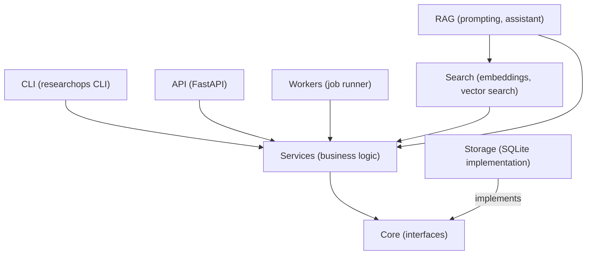
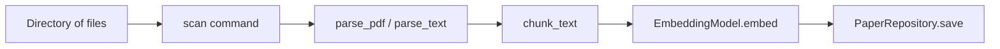
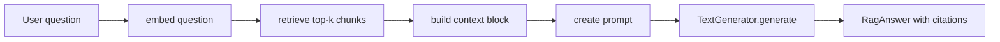

<!-- NAV_START -->
---
[🏠 Home](../../../README.md) · [🗺 Roadmap](../../../ROADMAP.md) · [📋 Syllabus](../../../SYLLABUS.md) · [🗂 Curriculum Map](../../NAVIGATION.md) · [📅 Month 5: Production and Portfolio](../README.md)

**Week 19 — Documentation and Portfolio Polish:** [README](README.md) · **Notes** · [Exercises](exercises.md) · [Break It](break_it.md) · [Validation](validation.md) · [Reflection](reflection.md)

⬅️ [← README](README.md) · ➡️ [Exercises →](exercises.md)

---
<!-- NAV_END -->

# Week 19 Notes: Documentation and Portfolio Polish

<!-- LEARNING_FORMAT_START -->
# Complete Learning Format — Week 19: Documentation and Portfolio Polish

This guide is the clean learning path for the chapter.
It uses short sentences.
It breaks ideas into small pieces.
It tells you what to focus on and what to ignore for now.
Read it before the older detailed notes that follow.

## Chapter overview

The chapter title is **Making your work legible to others**.
The practical milestone is: README is portfolio-quality. Architecture document explains every design decision. A demo script exists.
The expected capability is: Can write a clear architecture document, create a Mermaid diagram, write a README a hiring manager would find compelling.
This chapter is one step in the ResearchOps system, not a random lesson.
The visible feature matters because it proves the idea works.
The hidden skill matters because it lets you build the next chapter without confusion.
A complete pass through this chapter means you can read the code, run it, test it, break it, and explain it aloud.

Use this study order:
- Read the story first without typing.
- Trace the smallest code example.
- Find the project file that owns the behavior.
- Run the validation command.
- Explain one happy path and one failure path.

## What you already know from previous weeks

- Week 15 taught Async I/O Network Fetching; keep its responsibility in mind, but do not rebuild it here.
- Week 16 taught Local Worker and Job System; keep its responsibility in mind, but do not rebuild it here.
- Week 17 taught RAG Assistant; keep its responsibility in mind, but do not rebuild it here.
- Week 18 taught Docker and Environment Configuration; keep its responsibility in mind, but do not rebuild it here.
- You should be able to run the previous validation command before trusting new work.
- You should be able to point at the main file from the previous week and say what job it owns.
- If a previous idea feels weak, reread the example and trace one concrete value through it.
- The safest learning rhythm is: understand one thing, change one thing, test one thing, explain one thing.

## What problem this week solves

Week 19 solves the project problem behind **Documentation and Portfolio Polish**.
Before this chapter, ResearchOps has a gap.
The gap may be a missing feature, a missing boundary, a missing safety check, or a missing way to communicate with users.
This chapter closes that gap with a focused milestone.
Do not treat the milestone as a checklist only.
Treat it as proof that the idea belongs in the system.
- The concept `Technical writing: what an architecture document must explain` helps solve part of this gap.
- The concept `Mermaid diagrams: module dependency graph and data flow` helps solve part of this gap.
- The concept `README as a portfolio artefact: what a hiring manager needs to see` helps solve part of this gap.
- The concept `Demo script: a 5-minute walkthrough of the complete system` helps solve part of this gap.
- The concept `Docs-as-code: keeping documentation in sync with behaviour` helps solve part of this gap.

## Beginner mental model

Use a simple four-part model: input, owner, transformation, proof.
Input means the concrete thing entering the system.
Owner means the file, object, or function responsible for the decision.
Transformation means the useful change from raw data to meaningful result.
Proof means the test or command that confirms the result.
- Ask: what is the input for **Documentation and Portfolio Polish**?
- Ask: what is the owner for **Documentation and Portfolio Polish**?
- Ask: what is the transformation for **Documentation and Portfolio Polish**?
- Ask: what is the proof for **Documentation and Portfolio Polish**?
If you cannot answer those four questions, do not add more code yet.

## Core vocabulary

| Term | Simple meaning | Why it matters here |
|------|----------------|---------------------|
| Technical writing | Technical writing: what an architecture document must explain | This term names one job in the Week 19 milestone. |
| Mermaid diagrams | Mermaid diagrams: module dependency graph and data flow | This term names one job in the Week 19 milestone. |
| README as a portfolio artefact | README as a portfolio artefact: what a hiring manager needs to see | This term names one job in the Week 19 milestone. |
| Demo script | Demo script: a 5-minute walkthrough of the complete system | This term names one job in the Week 19 milestone. |
| Docs-as-code | Docs-as-code: keeping documentation in sync with behaviour | This term names one job in the Week 19 milestone. |
| Boundary | A line between responsibilities | It keeps the chapter understandable for a beginner. |
| Failure path | What happens when the happy path is not available | It keeps the chapter understandable for a beginner. |
| Validation | Evidence that the system still works | It keeps the chapter understandable for a beginner. |
| Responsibility | The one job a file or function owns | It keeps the chapter understandable for a beginner. |

## Concept explanations from first principles

Read each concept as if you have never heard the term before.
Do not skip the plain meaning.
### Concept 1: Technical writing: what an architecture document must explain
- **Plain meaning:** This is a named tool for solving one part of the chapter problem.
- **Why it exists:** Real projects become confusing when this concern is unnamed.
- **ResearchOps use:** In Week 19, it supports the milestone: README is portfolio-quality. Architecture document explains every design decision. A demo script exists.
- **Input question:** What data, command, file, request, or state reaches this concept?
- **Output question:** What value, saved record, response, log, or state change should come out?
- **Failure question:** What can be missing, malformed, slow, duplicated, stale, or invalid?
- **Test question:** Which test would catch the mistake before a user sees it?
- **Beginner trap:** Memorizing the word without tracing it in the project.
- **Recovery move:** Use one concrete example and follow it through the files.
- **Mastery signal:** You can explain the concept without saying "magic" or "it just works".

### Concept 2: Mermaid diagrams: module dependency graph and data flow
- **Plain meaning:** This is a named tool for solving one part of the chapter problem.
- **Why it exists:** Real projects become confusing when this concern is unnamed.
- **ResearchOps use:** In Week 19, it supports the milestone: README is portfolio-quality. Architecture document explains every design decision. A demo script exists.
- **Input question:** What data, command, file, request, or state reaches this concept?
- **Output question:** What value, saved record, response, log, or state change should come out?
- **Failure question:** What can be missing, malformed, slow, duplicated, stale, or invalid?
- **Test question:** Which test would catch the mistake before a user sees it?
- **Beginner trap:** Memorizing the word without tracing it in the project.
- **Recovery move:** Use one concrete example and follow it through the files.
- **Mastery signal:** You can explain the concept without saying "magic" or "it just works".

### Concept 3: README as a portfolio artefact: what a hiring manager needs to see
- **Plain meaning:** This is a named tool for solving one part of the chapter problem.
- **Why it exists:** Real projects become confusing when this concern is unnamed.
- **ResearchOps use:** In Week 19, it supports the milestone: README is portfolio-quality. Architecture document explains every design decision. A demo script exists.
- **Input question:** What data, command, file, request, or state reaches this concept?
- **Output question:** What value, saved record, response, log, or state change should come out?
- **Failure question:** What can be missing, malformed, slow, duplicated, stale, or invalid?
- **Test question:** Which test would catch the mistake before a user sees it?
- **Beginner trap:** Memorizing the word without tracing it in the project.
- **Recovery move:** Use one concrete example and follow it through the files.
- **Mastery signal:** You can explain the concept without saying "magic" or "it just works".

### Concept 4: Demo script: a 5-minute walkthrough of the complete system
- **Plain meaning:** This is a named tool for solving one part of the chapter problem.
- **Why it exists:** Real projects become confusing when this concern is unnamed.
- **ResearchOps use:** In Week 19, it supports the milestone: README is portfolio-quality. Architecture document explains every design decision. A demo script exists.
- **Input question:** What data, command, file, request, or state reaches this concept?
- **Output question:** What value, saved record, response, log, or state change should come out?
- **Failure question:** What can be missing, malformed, slow, duplicated, stale, or invalid?
- **Test question:** Which test would catch the mistake before a user sees it?
- **Beginner trap:** Memorizing the word without tracing it in the project.
- **Recovery move:** Use one concrete example and follow it through the files.
- **Mastery signal:** You can explain the concept without saying "magic" or "it just works".

### Concept 5: Docs-as-code: keeping documentation in sync with behaviour
- **Plain meaning:** This is a named tool for solving one part of the chapter problem.
- **Why it exists:** Real projects become confusing when this concern is unnamed.
- **ResearchOps use:** In Week 19, it supports the milestone: README is portfolio-quality. Architecture document explains every design decision. A demo script exists.
- **Input question:** What data, command, file, request, or state reaches this concept?
- **Output question:** What value, saved record, response, log, or state change should come out?
- **Failure question:** What can be missing, malformed, slow, duplicated, stale, or invalid?
- **Test question:** Which test would catch the mistake before a user sees it?
- **Beginner trap:** Memorizing the word without tracing it in the project.
- **Recovery move:** Use one concrete example and follow it through the files.
- **Mastery signal:** You can explain the concept without saying "magic" or "it just works".

## ResearchOps-specific application

The chapter belongs to these project locations:
- `README.md` — polished, portfolio-ready
- `ARCHITECTURE.md` — complete with diagrams
- `docs/diagrams/` — at least one Mermaid diagram
- `scripts/demo.sh` — end-to-end demo script
Study those files in this order:
1. Find the user-facing entry point.
2. Find the service or core concept that owns the meaning.
3. Find the infrastructure only when outside resources are needed.
4. Find the tests that prove the behavior.
5. Find the validation command that a learner runs manually.
The goal is to know why each file exists.
If two files seem to own the same decision, stop and clarify the boundary.

## Code examples with line-by-line explanation

```markdown
## Demo path
1. Ingest sample papers.
2. Search by keyword.
3. Ask a cited question.
4. Show tests and architecture.
```

Line-by-line explanation:
- Line 1: `## Demo path` — This performs one small visible step in the workflow.
- Line 2: `1. Ingest sample papers.` — This performs one small visible step in the workflow.
- Line 3: `2. Search by keyword.` — This performs one small visible step in the workflow.
- Line 4: `3. Ask a cited question.` — This performs one small visible step in the workflow.
- Line 5: `4. Show tests and architecture.` — This performs one small visible step in the workflow.

How to use this example:
- Name the input.
- Name the output.
- Predict the result before running anything.
- Connect the shape to the real ResearchOps file.
- Write one sentence about why each line belongs.

## Common beginner mistakes

- **Mistake:** Pasting code before knowing the owner of the behavior.
  **Why it hurts:** it hides the mental model and makes debugging harder.
  **Better move:** make one small behavior clear, then prove it.
- **Mistake:** Changing many files at once.
  **Why it hurts:** it hides the mental model and makes debugging harder.
  **Better move:** make one small behavior clear, then prove it.
- **Mistake:** Skipping the failure path.
  **Why it hurts:** it hides the mental model and makes debugging harder.
  **Better move:** make one small behavior clear, then prove it.
- **Mistake:** Reading only the happy path test.
  **Why it hurts:** it hides the mental model and makes debugging harder.
  **Better move:** make one small behavior clear, then prove it.
- **Mistake:** Ignoring the validation command.
  **Why it hurts:** it hides the mental model and makes debugging harder.
  **Better move:** make one small behavior clear, then prove it.
- **Mistake:** Using vague names.
  **Why it hurts:** it hides the mental model and makes debugging harder.
  **Better move:** make one small behavior clear, then prove it.
- **Mistake:** Putting business rules in the user interface layer.
  **Why it hurts:** it hides the mental model and makes debugging harder.
  **Better move:** make one small behavior clear, then prove it.
- **Mistake:** Treating logs, errors, and tests as decoration.
  **Why it hurts:** it hides the mental model and makes debugging harder.
  **Better move:** make one small behavior clear, then prove it.
- **Mistake:** Optimizing before correctness is visible.
  **Why it hurts:** it hides the mental model and makes debugging harder.
  **Better move:** make one small behavior clear, then prove it.
- **Mistake:** Building future-week features early.
  **Why it hurts:** it hides the mental model and makes debugging harder.
  **Better move:** make one small behavior clear, then prove it.

## Debugging guidance

- Copy the exact failing command.
- Read the first useful error line.
- Read the final error line.
- Classify the failure as import, input, state, file, database, network, model, or expectation.
- Reproduce it with the smallest command.
- Inspect the value closest to the failure.
- Fix the cause, not only the symptom.
- Run the narrowest test.
- Run the chapter validation command.
- Write down what the error was teaching.
Debugging questions:
- What did I expect?
- What happened?
- Which value first became wrong?
- Which layer created that value?
- Which test should catch this next time?

## Design tradeoffs

- **Simple first version:** Easy to understand, but not the final production shape.
- **Clear layers:** More files, but less confusion as features grow.
- **Explicit errors:** More code, but failures become teachable.
- **Small unit tests:** Fast feedback, but less end-to-end confidence.
- **Integration tests:** Real wiring, but slower and more setup.
- **Configuration:** Flexible behavior, but defaults must be clear.
The right question is not "What is the fanciest design?"
The right question is "What design teaches the responsibility clearly and can grow next week?"

## Testing implications

Tests for this chapter:
- All existing tests must still pass (no regressions)
Validation commands:
```bash
pytest -q
ruff check src tests
researchops --help
```
- Arrange the data.
- Act on the system.
- Assert the visible promise.
- Check one failure path.
- Keep unit tests fast.
- Use integration tests only when real wiring matters.

## Architecture implications

ResearchOps stays understandable when dependencies point inward.
```text
CLI / API / Worker -> Services -> Core
Infrastructure implements core-facing contracts and is wired at the outside.
```
- Does the UI layer avoid business logic?
- Does the service layer own workflow decisions?
- Does core avoid infrastructure imports?
- Does infrastructure do outside-world work?
- Do tests use fakes when possible?
Architecture is not ceremony.
Architecture is named responsibility.

## How this connects to AI engineering / ML research

AI engineering needs more than models.
It needs reliable data flow, clear interfaces, repeatable experiments, visible failures, and honest evaluation.
Week 19 contributes by making **documentation and portfolio polish** clear enough to trust.
- Bad data creates bad model behavior.
- Unclear boundaries make experiments hard to reproduce.
- Missing tests let regressions change research results silently.
- Good logs and errors shorten investigation time.
- Clear documentation lets future users understand the system.

## Mini quizzes

- What problem does Week 19 solve?
- What is the main input?
- What is the main output?
- Which file owns the main responsibility?
- Which layer should not contain business logic?
- What is one happy path?
- What is one failure path?
- What command proves the chapter works?
- What should you not build early?
- How does this prepare the next week?

## Explain-it-aloud prompts

- Explain Documentation and Portfolio Polish in simple words.
- Explain the data flow from input to result.
- Explain the first file you would open.
- Explain the test that gives confidence.
- Explain what can break.
- Explain the tradeoff made in this chapter.
- Explain what you still find weak.

## What to memorize

- The topic: Documentation and Portfolio Polish.
- The milestone: README is portfolio-quality. Architecture document explains every design decision. A demo script exists.
- The main project files.
- The validation command.
- The boundary rule for the layer you are touching.
- The habit of testing before moving forward.

## What to understand deeply

- Why this feature belongs now.
- How data moves through the chapter.
- Which file owns which decision.
- How the failure path is handled.
- Why the tests prove behavior.
- How this week makes future work safer.

## What not to worry about yet

- Perfect scale.
- Fancy abstractions.
- Future-week features.
- Every option in every library.
- Premature optimization.
- Comparing your speed to someone else.
Focus on the milestone.
A clear small milestone beats a confusing large one.

## Bridge to next week

Next week is Week 20: **Final Hardening and v1.0 Release**.
This week prepares you by giving ResearchOps a clearer piece of behavior before the next milestone: `v1.0.0` is tagged. CI is green. Every ROADMAP.md row is ✅. A demo exists. The project is portfolio-ready.
- Run validation.
- Explain the main files.
- Explain one failure.
- Explain one test.
- Write down what still feels weak before moving on.

## Guided deepening drills

Use these drills if the chapter still feels abstract.
- Drill 1: Trace `Technical writing: what an architecture document must explain` from user input to project result.
- Drill 2: Write one sentence defining `Technical writing: what an architecture document must explain` without copying the notes.
- Drill 3: Find the file where `Technical writing: what an architecture document must explain` appears or should appear.
- Drill 4: Name one wrong implementation of `Technical writing: what an architecture document must explain` and why it would hurt.
- Drill 5: Name one test that would protect `Technical writing: what an architecture document must explain`.
- Drill 6: Trace `Mermaid diagrams: module dependency graph and data flow` from user input to project result.
- Drill 7: Write one sentence defining `Mermaid diagrams: module dependency graph and data flow` without copying the notes.
- Drill 8: Find the file where `Mermaid diagrams: module dependency graph and data flow` appears or should appear.
- Drill 9: Name one wrong implementation of `Mermaid diagrams: module dependency graph and data flow` and why it would hurt.
- Drill 10: Name one test that would protect `Mermaid diagrams: module dependency graph and data flow`.
- Drill 11: Trace `README as a portfolio artefact: what a hiring manager needs to see` from user input to project result.
- Drill 12: Write one sentence defining `README as a portfolio artefact: what a hiring manager needs to see` without copying the notes.
- Drill 13: Find the file where `README as a portfolio artefact: what a hiring manager needs to see` appears or should appear.
- Drill 14: Name one wrong implementation of `README as a portfolio artefact: what a hiring manager needs to see` and why it would hurt.
- Drill 15: Name one test that would protect `README as a portfolio artefact: what a hiring manager needs to see`.
- Drill 16: Trace `Demo script: a 5-minute walkthrough of the complete system` from user input to project result.
- Drill 17: Write one sentence defining `Demo script: a 5-minute walkthrough of the complete system` without copying the notes.
- Drill 18: Find the file where `Demo script: a 5-minute walkthrough of the complete system` appears or should appear.
- Drill 19: Name one wrong implementation of `Demo script: a 5-minute walkthrough of the complete system` and why it would hurt.
- Drill 20: Name one test that would protect `Demo script: a 5-minute walkthrough of the complete system`.
- Drill 21: Trace `Docs-as-code: keeping documentation in sync with behaviour` from user input to project result.
- Drill 22: Write one sentence defining `Docs-as-code: keeping documentation in sync with behaviour` without copying the notes.
- Drill 23: Find the file where `Docs-as-code: keeping documentation in sync with behaviour` appears or should appear.
- Drill 24: Name one wrong implementation of `Docs-as-code: keeping documentation in sync with behaviour` and why it would hurt.
- Drill 25: Name one test that would protect `Docs-as-code: keeping documentation in sync with behaviour`.
- Drill 26: Draw the Week 19 data flow in four boxes.
- Drill 27: Say why `Documentation and Portfolio Polish` belongs in this month of the curriculum.
- Drill 28: Rewrite one error message in beginner-friendly language.
- Drill 29: List the exact assumptions made by the example code.
- Drill 30: List the exact assumptions checked by the tests.

<!-- LEARNING_FORMAT_END -->

---

# Existing detailed notes
## Why documentation matters

A project without documentation is a project only you can use today and only you can understand six months from now.

Documentation is not extra work on top of real work. It is part of building a real project. The difference between a side project and a portfolio project is often entirely in the documentation.

When you apply for engineering roles, the interviewer reads the README before looking at the code. If the README is confusing or missing, they may not look further. A well-written README is the first impression of your engineering judgement.

There are also practical reasons:
- **Future you** will forget how the project works. Good documentation means you can return to it after six months and understand it in ten minutes.
- **Teammates or contributors** need to understand the project to help.
- **Deployment**: documentation often contains the exact commands needed to run the application, which is essential during incidents.

---

## Reader personas

Before writing a word, decide who you are writing for. Different readers need different things.

### Recruiter

A recruiter is not a technical expert. They spend 30 seconds on your README. They want to know:
- What does this project do?
- Is it real and working?
- Does this person communicate clearly?

Write for them: use plain language in the opening paragraph. Avoid jargon in the first two paragraphs. Make the project sound interesting without making it sound complex.

### Engineer

A fellow engineer or interviewer will look at:
- The architecture section: is the design sensible?
- The code structure: are the names and modules logical?
- The test coverage and CI setup.
- Whether the project is actually runnable.

Write for them: be precise. Explain tradeoffs honestly. Do not hide complexity. Engineers respect honest documentation of limitations more than inflated claims.

### Future you

Six months from now, you will have forgotten the details. Future you needs:
- The exact commands to start the application from a fresh clone.
- The rationale for key design decisions (not just what you did, but why).
- A description of the known limitations so you do not repeat the same debugging.

Write for future you: treat the documentation as a gift to yourself.

### Professor or research mentor

If this project is for an academic context, the reader may want:
- A clear problem statement.
- An explanation of the technical approach.
- Evidence that the system works (tests, demos, results).
- An honest assessment of limitations.
- References to prior work where relevant.

---

## README structure that works

A strong project README has these sections in this order:

### 1. What is this? (one concise paragraph)

Do not start with "This project is..." or "I built this project to...". Start with what the project does and why it matters.

**Weak**: "This is a Python project I built to learn about RAG."

**Strong**: "ResearchOps is a command-line tool and API for indexing research papers and asking questions about them using retrieval-augmented generation. It stores papers as vector embeddings and retrieves relevant passages to ground AI-generated answers."

### 2. Who is it for? (one sentence)

"For researchers and engineers who need to search and query large collections of academic papers."

### 3. Quick Start (install + first command)

This must work from a fresh clone. Test it yourself. Include the exact commands:

```bash
git clone https://github.com/YOUR_USERNAME/researchops_python_mastery.git
cd researchops_python_mastery
python -m venv .venv && source .venv/bin/activate
pip install -e ".[all]"
researchops --help
```

### 4. Features (what it can do)

A bulleted list of capabilities:
- Ingest research papers from a directory
- Full-text keyword search
- Semantic vector search
- RAG-powered Q&A with citations
- FastAPI REST interface
- Background job processing
- Docker packaging

### 5. Architecture (a high-level diagram or summary)

A short Mermaid diagram and a sentence explaining each layer. See the architecture diagram section below.

### 6. How to use it (common workflows)

Show two or three real usage examples with actual commands and expected output.

### 7. How to run tests

```bash
pytest --cov=researchops --cov-report=term-missing -q
ruff check src tests
```

### 8. Project status

A short, honest statement:
- What is fully working.
- What is partially working or experimental.
- What is on the roadmap.

---

## Before / after README example

### Before (weak)

```markdown
# ResearchOps

This is my Python learning project. It does search and stuff.

To run it: install Python and then run the main file.
```

Problems:
- "stuff" is not a description.
- "install Python" is not a quick-start guide.
- No architecture, no features, no example commands.
- The reader has no idea what the project does or why it matters.

### After (strong)

```markdown
# ResearchOps

ResearchOps is a command-line tool and HTTP API for indexing and searching research
papers. It supports keyword search, semantic vector search using local embeddings,
and retrieval-augmented generation for grounded Q&A with citations.

Built as a 20-week learning project covering Python architecture, storage,
ML engineering, async I/O, FastAPI, and Docker.

## Quick Start

\```bash
git clone https://github.com/YOUR_USERNAME/researchops_python_mastery.git
cd researchops_python_mastery
python -m venv .venv && source .venv/bin/activate
pip install -e ".[all]"
researchops ingest ./examples/sample_papers
researchops search "attention mechanism"
\```

## Features

- Ingest PDFs and text files from a directory
- Keyword search with BM25-style ranking
- Semantic search using sentence-transformers embeddings
- RAG Q&A with grounded answers and citations
- REST API via FastAPI
- Async background ingestion jobs
- Docker packaging with docker-compose

## Architecture

\```mermaid
graph TD
    CLI --> Services
    API --> Services
    Workers --> Services
    Services --> Core
    Storage -->|implements| Core
    Search -->|implements| Core
\```

See ARCHITECTURE.md for full detail.

## Running Tests

\```bash
pytest --cov=researchops --cov-report=term-missing -q
ruff check src tests
\```

## Project Status

v1.0.0 is complete. Core features work end-to-end. Known limitations: semantic
search is in-memory (no persistence across restarts without re-indexing). See
ROADMAP.md for planned improvements.
```

---

## Architecture diagrams

Architecture diagrams communicate how the system works without requiring the reader to read all the code. GitHub renders Mermaid diagrams natively.

### Module dependency diagram



### Ingestion pipeline



### RAG pipeline



Each diagram in `docs/diagrams/` corresponds to one aspect of the system. Keep diagrams focused. A diagram that shows everything shows nothing.

### Text-based architecture template

If Mermaid is not available, use ASCII:

```text
┌─────────┐   ┌─────────┐   ┌─────────────┐
│   CLI   │   │   API   │   │   Workers   │
└────┬────┘   └────┬────┘   └──────┬──────┘
     │              │               │
     └──────────────┴───────────────┘
                    │
             ┌──────┴──────┐
             │  Services   │
             └──────┬──────┘
                    │
        ┌───────────┴───────────┐
        │                       │
   ┌────┴────┐           ┌──────┴──────┐
   │ Storage │           │   Search    │
   └─────────┘           └─────────────┘
```

---

## Demo script

A demo script is a written, step-by-step walkthrough that someone can follow to see the project work in a live session, such as an interview or a presentation.

### Why write it?

1. Forces you to verify that every command still works before the demo.
2. Gives you a script to follow under pressure.
3. Can be shared as `docs/demo.md` so interviewers can try it themselves.

### Structure: the 2-minute demo template

```markdown
# ResearchOps 2-Minute Demo

## Setup (30 seconds)

\```bash
git clone https://github.com/YOUR_USERNAME/researchops_python_mastery.git
cd researchops_python_mastery
python -m venv .venv && source .venv/bin/activate
pip install -e ".[all]"
\```

Expected: "Successfully installed researchops..."

## Ingest (20 seconds)

\```bash
researchops ingest ./examples/sample_papers
\```

Expected output:
\```
Ingested 3 papers.
\```

## Search (20 seconds)

\```bash
researchops search "attention mechanism"
\```

Expected output:
\```
[1] "Attention Is All You Need" (Vaswani et al., 2017) — score: 0.91
[2] "BERT: Pre-training of Deep Bidirectional Transformers" — score: 0.73
\```

## Ask (20 seconds)

\```bash
researchops ask "What is the main contribution of the attention paper?"
\```

Expected output:
\```
Answer: The paper introduces the Transformer architecture, which replaces
recurrence with self-attention for sequence modelling. [source: paper-1, chunk-3]
\```

## API (30 seconds)

\```bash
# In terminal 1:
uvicorn researchops.api.main:app --port 8000

# In terminal 2:
curl http://localhost:8000/papers | python -m json.tool
\```

Expected: JSON list of ingested papers.
```

---

## Limitations section

Every honest project has a limitations section. This is not a weakness. It demonstrates engineering judgment. Interviewers respect engineers who know where their systems break down.

A limitations section should state:
- What the project does not do that you might expect it to.
- What breaks under specific conditions.
- What you would fix with more time.

Example:

```markdown
## Known Limitations

- **In-memory vector index**: the embedding index is rebuilt from scratch on every
  application startup. Papers ingested in one session are not available in the next
  unless re-indexed. A future version would persist embeddings to SQLite.

- **Single-file PDF extraction**: PDF parsing uses pdfminer and may fail on
  scanned PDFs or PDFs with complex layouts. Plain-text papers are more reliable.

- **No authentication**: the API has no authentication layer. Do not expose it to
  the internet without adding authentication first.

- **Fake generator in production path**: the current implementation uses
  FakeTextGenerator by default. Real generation requires configuring an Ollama
  instance or an API key.
```

---

## Future work section

A future work section shows that you understand the project beyond its current state. It demonstrates product thinking.

```markdown
## Future Work

- Persist the vector index to SQLite to survive restarts.
- Add hybrid search (keyword + semantic) with score fusion.
- Add a streaming API endpoint for real-time RAG responses.
- Add document versioning so updated papers can be re-indexed without duplicates.
- Add authentication to the API.
- Support OpenAI-compatible API providers via configuration.
```

Keep future work realistic. Do not list things you have no idea how to implement.

---

## How to explain tradeoffs

One of the most impressive things you can do in an interview is explain why you made a technical decision — not just what you did.

The structure for explaining a tradeoff:

1. **What I chose**: state the decision clearly.
2. **Why**: the specific reason this choice was better for this project.
3. **What I gave up**: acknowledge the cost.
4. **When I would choose differently**: describe the context in which the other option wins.

Example:

"I chose SQLite over PostgreSQL because ResearchOps is a single-user local tool, not a multi-user service. SQLite requires no server setup, which made the development and demo experience much simpler. I gave up concurrent write capability and the richer query planner. I would choose PostgreSQL if I needed multiple users writing simultaneously or if the dataset grew beyond a few hundred thousand rows."

---

## How to write a portfolio story

A portfolio story answers: what problem did I solve, how did I solve it, and what did I learn?

It has three parts:

**The problem**: "Researchers who accumulate hundreds of papers have no good way to search them semantically or ask questions about them."

**The solution**: "I built ResearchOps: a local tool that ingests papers, indexes them with sentence-transformer embeddings, and answers questions using retrieval-augmented generation with citations."

**What you learned**: "I learned that good retrieval is the foundation of good RAG. The hardest part was not the language model integration — that was straightforward with the provider abstraction — but ensuring that chunking and embedding quality were good enough to retrieve relevant passages for non-obvious queries."

Keep the story to two to three minutes for a verbal version. For a written version (LinkedIn, portfolio site), two to three paragraphs.

---

## How to prepare for interview discussion

Expect these questions. Prepare real answers:

**"Walk me through the architecture."**
Use the Mermaid diagram. Describe the layers in one sentence each. Explain why you separated CLI, API, and Services.

**"Why did you choose [technology X]?"**
Use the tradeoff structure above: what I chose, why, what I gave up, when I would choose differently.

**"What would you do differently if you started over?"**
Pick one real thing. Do not say "nothing". Engineers who learned nothing did not actually build the project.

**"What is the hardest bug you had to fix?"**
Have a specific story ready. Walk through: symptoms → hypothesis → investigation → fix → prevention. The process is more impressive than the bug itself.

**"What are the limitations of the current system?"**
Read your limitations section aloud. This shows self-awareness and production thinking.

**"How does the RAG pipeline work?"**
Walk through the seven-step pipeline from notes.md. Use the diagram. Mention what happens when retrieval fails.

---

## Summary

- Documentation is part of the project, not extra work.
- Write for your reader: recruiter, engineer, future you, professor.
- A strong README follows a consistent structure: what, who, quick start, features, architecture, usage, tests, status.
- Architecture diagrams communicate structure faster than prose.
- A demo script ensures the demo always works.
- A limitations section shows engineering judgment.
- Tradeoffs explained with a structured format impress interviewers.
- A portfolio story answers: problem, solution, and what you learned.
<!-- NAV_BOTTOM_START -->
---
⬅️ [← README](README.md) · ➡️ [Exercises →](exercises.md)

**Week 19 — Documentation and Portfolio Polish:** [README](README.md) · **Notes** · [Exercises](exercises.md) · [Break It](break_it.md) · [Validation](validation.md) · [Reflection](reflection.md)

[🏠 Home](../../../README.md) · [🗺 Roadmap](../../../ROADMAP.md) · [📋 Syllabus](../../../SYLLABUS.md) · [🗂 Curriculum Map](../../NAVIGATION.md) · [📅 Month 5: Production and Portfolio](../README.md)
---
<!-- NAV_BOTTOM_END -->
