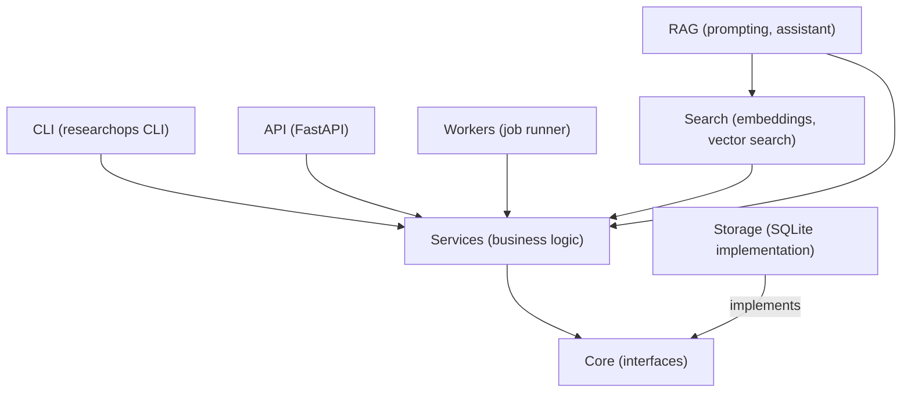
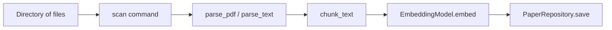
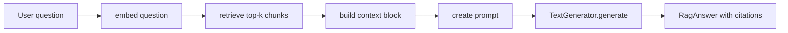

# Week 19 Notes: Documentation and Portfolio Polish

## Why documentation matters

A project without documentation is a project only you can use today and only you can understand six months from now.

Documentation is not extra work on top of real work. It is part of building a real project. The difference between a side project and a portfolio project is often entirely in the documentation.

When you apply for engineering roles, the interviewer reads the README before looking at the code. If the README is confusing or missing, they may not look further. A well-written README is the first impression of your engineering judgement.

There are also practical reasons:
- **Future you** will forget how the project works. Good documentation means you can return to it after six months and understand it in ten minutes.
- **Teammates or contributors** need to understand the project to help.
- **Deployment**: documentation often contains the exact commands needed to run the application, which is essential during incidents.

---

## Reader personas

Before writing a word, decide who you are writing for. Different readers need different things.

### Recruiter

A recruiter is not a technical expert. They spend 30 seconds on your README. They want to know:
- What does this project do?
- Is it real and working?
- Does this person communicate clearly?

Write for them: use plain language in the opening paragraph. Avoid jargon in the first two paragraphs. Make the project sound interesting without making it sound complex.

### Engineer

A fellow engineer or interviewer will look at:
- The architecture section: is the design sensible?
- The code structure: are the names and modules logical?
- The test coverage and CI setup.
- Whether the project is actually runnable.

Write for them: be precise. Explain tradeoffs honestly. Do not hide complexity. Engineers respect honest documentation of limitations more than inflated claims.

### Future you

Six months from now, you will have forgotten the details. Future you needs:
- The exact commands to start the application from a fresh clone.
- The rationale for key design decisions (not just what you did, but why).
- A description of the known limitations so you do not repeat the same debugging.

Write for future you: treat the documentation as a gift to yourself.

### Professor or research mentor

If this project is for an academic context, the reader may want:
- A clear problem statement.
- An explanation of the technical approach.
- Evidence that the system works (tests, demos, results).
- An honest assessment of limitations.
- References to prior work where relevant.

---

## README structure that works

A strong project README has these sections in this order:

### 1. What is this? (one concise paragraph)

Do not start with "This project is..." or "I built this project to...". Start with what the project does and why it matters.

**Weak**: "This is a Python project I built to learn about RAG."

**Strong**: "ResearchOps is a command-line tool and API for indexing research papers and asking questions about them using retrieval-augmented generation. It stores papers as vector embeddings and retrieves relevant passages to ground AI-generated answers."

### 2. Who is it for? (one sentence)

"For researchers and engineers who need to search and query large collections of academic papers."

### 3. Quick Start (install + first command)

This must work from a fresh clone. Test it yourself. Include the exact commands:

```bash
git clone https://github.com/YOUR_USERNAME/researchops_python_mastery.git
cd researchops_python_mastery
python -m venv .venv && source .venv/bin/activate
pip install -e ".[all]"
researchops --help
```

### 4. Features (what it can do)

A bulleted list of capabilities:
- Ingest research papers from a directory
- Full-text keyword search
- Semantic vector search
- RAG-powered Q&A with citations
- FastAPI REST interface
- Background job processing
- Docker packaging

### 5. Architecture (a high-level diagram or summary)

A short Mermaid diagram and a sentence explaining each layer. See the architecture diagram section below.

### 6. How to use it (common workflows)

Show two or three real usage examples with actual commands and expected output.

### 7. How to run tests

```bash
pytest --cov=researchops --cov-report=term-missing -q
ruff check src tests
```

### 8. Project status

A short, honest statement:
- What is fully working.
- What is partially working or experimental.
- What is on the roadmap.

---

## Before / after README example

### Before (weak)

```markdown
# ResearchOps

This is my Python learning project. It does search and stuff.

To run it: install Python and then run the main file.
```

Problems:
- "stuff" is not a description.
- "install Python" is not a quick-start guide.
- No architecture, no features, no example commands.
- The reader has no idea what the project does or why it matters.

### After (strong)

```markdown
# ResearchOps

ResearchOps is a command-line tool and HTTP API for indexing and searching research
papers. It supports keyword search, semantic vector search using local embeddings,
and retrieval-augmented generation for grounded Q&A with citations.

Built as a 20-week learning project covering Python architecture, storage,
ML engineering, async I/O, FastAPI, and Docker.

## Quick Start

\```bash
git clone https://github.com/YOUR_USERNAME/researchops_python_mastery.git
cd researchops_python_mastery
python -m venv .venv && source .venv/bin/activate
pip install -e ".[all]"
researchops ingest ./examples/sample_papers
researchops search "attention mechanism"
\```

## Features

- Ingest PDFs and text files from a directory
- Keyword search with BM25-style ranking
- Semantic search using sentence-transformers embeddings
- RAG Q&A with grounded answers and citations
- REST API via FastAPI
- Async background ingestion jobs
- Docker packaging with docker-compose

## Architecture

\```mermaid
graph TD
    CLI --> Services
    API --> Services
    Workers --> Services
    Services --> Core
    Storage -->|implements| Core
    Search -->|implements| Core
\```

See ARCHITECTURE.md for full detail.

## Running Tests

\```bash
pytest --cov=researchops --cov-report=term-missing -q
ruff check src tests
\```

## Project Status

v1.0.0 is complete. Core features work end-to-end. Known limitations: semantic
search is in-memory (no persistence across restarts without re-indexing). See
ROADMAP.md for planned improvements.
```

---

## Architecture diagrams

Architecture diagrams communicate how the system works without requiring the reader to read all the code. GitHub renders Mermaid diagrams natively.

### Module dependency diagram



### Ingestion pipeline



### RAG pipeline



Each diagram in `docs/diagrams/` corresponds to one aspect of the system. Keep diagrams focused. A diagram that shows everything shows nothing.

### Text-based architecture template

If Mermaid is not available, use ASCII:

```text
┌─────────┐   ┌─────────┐   ┌─────────────┐
│   CLI   │   │   API   │   │   Workers   │
└────┬────┘   └────┬────┘   └──────┬──────┘
     │              │               │
     └──────────────┴───────────────┘
                    │
             ┌──────┴──────┐
             │  Services   │
             └──────┬──────┘
                    │
        ┌───────────┴───────────┐
        │                       │
   ┌────┴────┐           ┌──────┴──────┐
   │ Storage │           │   Search    │
   └─────────┘           └─────────────┘
```

---

## Demo script

A demo script is a written, step-by-step walkthrough that someone can follow to see the project work in a live session, such as an interview or a presentation.

### Why write it?

1. Forces you to verify that every command still works before the demo.
2. Gives you a script to follow under pressure.
3. Can be shared as `docs/demo.md` so interviewers can try it themselves.

### Structure: the 2-minute demo template

```markdown
# ResearchOps 2-Minute Demo

## Setup (30 seconds)

\```bash
git clone https://github.com/YOUR_USERNAME/researchops_python_mastery.git
cd researchops_python_mastery
python -m venv .venv && source .venv/bin/activate
pip install -e ".[all]"
\```

Expected: "Successfully installed researchops..."

## Ingest (20 seconds)

\```bash
researchops ingest ./examples/sample_papers
\```

Expected output:
\```
Ingested 3 papers.
\```

## Search (20 seconds)

\```bash
researchops search "attention mechanism"
\```

Expected output:
\```
[1] "Attention Is All You Need" (Vaswani et al., 2017) — score: 0.91
[2] "BERT: Pre-training of Deep Bidirectional Transformers" — score: 0.73
\```

## Ask (20 seconds)

\```bash
researchops ask "What is the main contribution of the attention paper?"
\```

Expected output:
\```
Answer: The paper introduces the Transformer architecture, which replaces
recurrence with self-attention for sequence modelling. [source: paper-1, chunk-3]
\```

## API (30 seconds)

\```bash
# In terminal 1:
uvicorn researchops.api.main:app --port 8000

# In terminal 2:
curl http://localhost:8000/papers | python -m json.tool
\```

Expected: JSON list of ingested papers.
```

---

## Limitations section

Every honest project has a limitations section. This is not a weakness. It demonstrates engineering judgment. Interviewers respect engineers who know where their systems break down.

A limitations section should state:
- What the project does not do that you might expect it to.
- What breaks under specific conditions.
- What you would fix with more time.

Example:

```markdown
## Known Limitations

- **In-memory vector index**: the embedding index is rebuilt from scratch on every
  application startup. Papers ingested in one session are not available in the next
  unless re-indexed. A future version would persist embeddings to SQLite.

- **Single-file PDF extraction**: PDF parsing uses pdfminer and may fail on
  scanned PDFs or PDFs with complex layouts. Plain-text papers are more reliable.

- **No authentication**: the API has no authentication layer. Do not expose it to
  the internet without adding authentication first.

- **Fake generator in production path**: the current implementation uses
  FakeTextGenerator by default. Real generation requires configuring an Ollama
  instance or an API key.
```

---

## Future work section

A future work section shows that you understand the project beyond its current state. It demonstrates product thinking.

```markdown
## Future Work

- Persist the vector index to SQLite to survive restarts.
- Add hybrid search (keyword + semantic) with score fusion.
- Add a streaming API endpoint for real-time RAG responses.
- Add document versioning so updated papers can be re-indexed without duplicates.
- Add authentication to the API.
- Support OpenAI-compatible API providers via configuration.
```

Keep future work realistic. Do not list things you have no idea how to implement.

---

## How to explain tradeoffs

One of the most impressive things you can do in an interview is explain why you made a technical decision — not just what you did.

The structure for explaining a tradeoff:

1. **What I chose**: state the decision clearly.
2. **Why**: the specific reason this choice was better for this project.
3. **What I gave up**: acknowledge the cost.
4. **When I would choose differently**: describe the context in which the other option wins.

Example:

"I chose SQLite over PostgreSQL because ResearchOps is a single-user local tool, not a multi-user service. SQLite requires no server setup, which made the development and demo experience much simpler. I gave up concurrent write capability and the richer query planner. I would choose PostgreSQL if I needed multiple users writing simultaneously or if the dataset grew beyond a few hundred thousand rows."

---

## How to write a portfolio story

A portfolio story answers: what problem did I solve, how did I solve it, and what did I learn?

It has three parts:

**The problem**: "Researchers who accumulate hundreds of papers have no good way to search them semantically or ask questions about them."

**The solution**: "I built ResearchOps: a local tool that ingests papers, indexes them with sentence-transformer embeddings, and answers questions using retrieval-augmented generation with citations."

**What you learned**: "I learned that good retrieval is the foundation of good RAG. The hardest part was not the language model integration — that was straightforward with the provider abstraction — but ensuring that chunking and embedding quality were good enough to retrieve relevant passages for non-obvious queries."

Keep the story to two to three minutes for a verbal version. For a written version (LinkedIn, portfolio site), two to three paragraphs.

---

## How to prepare for interview discussion

Expect these questions. Prepare real answers:

**"Walk me through the architecture."**
Use the Mermaid diagram. Describe the layers in one sentence each. Explain why you separated CLI, API, and Services.

**"Why did you choose [technology X]?"**
Use the tradeoff structure above: what I chose, why, what I gave up, when I would choose differently.

**"What would you do differently if you started over?"**
Pick one real thing. Do not say "nothing". Engineers who learned nothing did not actually build the project.

**"What is the hardest bug you had to fix?"**
Have a specific story ready. Walk through: symptoms → hypothesis → investigation → fix → prevention. The process is more impressive than the bug itself.

**"What are the limitations of the current system?"**
Read your limitations section aloud. This shows self-awareness and production thinking.

**"How does the RAG pipeline work?"**
Walk through the seven-step pipeline from notes.md. Use the diagram. Mention what happens when retrieval fails.

---

## Summary

- Documentation is part of the project, not extra work.
- Write for your reader: recruiter, engineer, future you, professor.
- A strong README follows a consistent structure: what, who, quick start, features, architecture, usage, tests, status.
- Architecture diagrams communicate structure faster than prose.
- A demo script ensures the demo always works.
- A limitations section shows engineering judgment.
- Tradeoffs explained with a structured format impress interviewers.
- A portfolio story answers: problem, solution, and what you learned.
