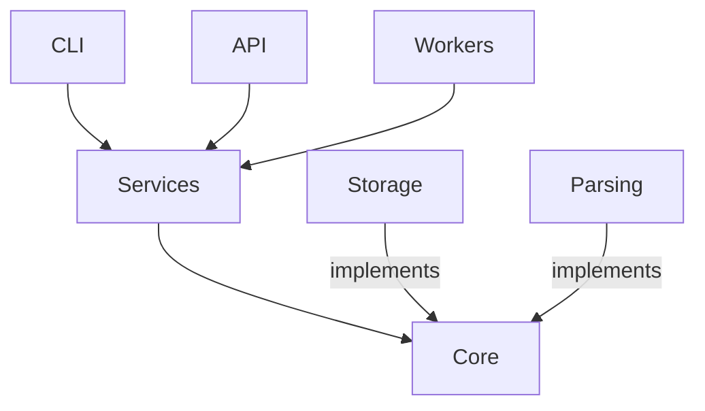

# Week 19 Notes: Documentation and Portfolio Polish

## Why Documentation Matters

A project without documentation is a project only you can use. For a portfolio project, that means a project only you can evaluate. Every interview where you show this project, the interviewer will look at the README first.

## The README Structure That Works

A strong project README has these sections in this order:
1. **What is this?** (one paragraph)
2. **Who is it for?** (one sentence)
3. **Quick Start** (install + first command)
4. **Features** (what it can do)
5. **Architecture** (high-level diagram)
6. **How to use it** (common workflows)
7. **How to run tests**
8. **Project status** (what's done, what's planned)

## Mermaid Diagrams

GitHub renders Mermaid diagrams natively. Use them to explain architecture:

## Technical Writing Rules

1. **Write for the reader, not for yourself.** The reader doesn't know what you know.
2. **Use short sentences.** If a sentence has more than two clauses, split it.
3. **Active voice.** "The service calls the repository" not "The repository is called by the service."
4. **Show, don't tell.** Code examples beat prose explanations every time.
5. **Every section should answer a question.** If you can't name the question, delete the section.

## Demo Script Structure

A 5-minute demo should follow this arc:
1. Install (30 seconds) — `pip install -e ".[all]"`
2. Ingest (45 seconds) — `researchops ingest ./examples/sample_papers`
3. Search (45 seconds) — keyword then semantic
4. Ask (60 seconds) — RAG question
5. API (60 seconds) — `curl` a few endpoints
6. Wow (60 seconds) — show the experiment comparison
