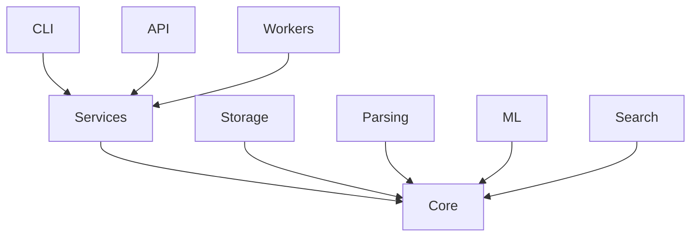

# ResearchOps — Diagrams

Architecture diagrams will be added here during Week 19.

## Planned diagrams

- Module dependency graph
- Data flow: PDF → Paper (ingestion pipeline)
- Data flow: Question → Answer (RAG pipeline)
- API route map
- Job state machine

## Tools

Diagrams will be written in [Mermaid](https://mermaid.js.org/) format so they render directly in GitHub.

